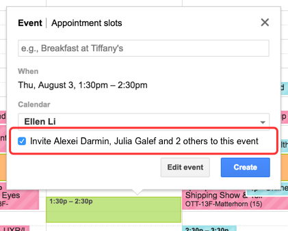

## Auto Invite for Google Calendar

*What I'm building.*

**Auto-Invite for Google Calendar** is for anyone who loads up multiple calendars to find a time that works with everyone's schedules. Once you've found a good time slot, create an event and automatically (!!) send invites to the calendars you've loaded up.
